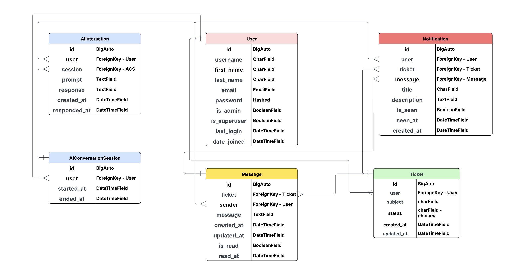

# Family AI

[View the live project here.](https://family-ai-3bfb51c271b9.herokuapp.com)

Family AI is a **smart chatbot** designed to help family members troubleshoot technology issues. Powered by **OpenAI's API** and built with **Django**, it provides step-by-step guidance in a conversational, user-friendly interface.

---

## Project Overview
Family AI simplifies tech support by offering **AI-driven assistance** for common device, software, and connectivity problems. Whether it's fixing a printer or setting up a smartphone, the chatbot delivers **clear, jargon-free solutions** tailored for all ages.

---

## Target Audience
- **Non-tech-savvy family members** - Elderly parents, children, or relatives needing simple guidance.
- **Busy caregivers** - Those assisting others with tech issues remotely.
- **Households with shared devices** - Families managing multiple gadgets and accounts.

---

## Key Features
✅ **AI-Powered Troubleshooting** - Uses OpenAI to interpret and resolve tech issues.  
✅ **Conversational Interface** - Chat-based interaction for ease of use.  
✅ **Multi-Device Support** - Covers smartphones, laptops, smart TVs, and more.  
✅ **Django Backend** - Reliable and scalable for future enhancements.  

---

## User Experience (UX)

### Design

#### Color Scheme
- **Primary**: `#134F5C` ("Deep Teal")  
  Used for: Headers, footers, and primary text in the main body  
- **Secondary**: `#FFFFFF` ("Pure White")  
  Used for: Dividing lines between sections, header/footer text  
- **Tertiary**: `#A2C4C9` ("Misty Blue")  
  Used for: Main background color

#### Typography
- **Body Text**: `Commissioner, sans-serif`
- **Headings**:  `Genos, cursive`

#### Wireframes


### Entity Relationship Diagram



---

## Technologies Used

- **Languages**: Python, HTML, CSS, JavaScript
- **Frameworks**: Django, Bootstrap
- **AI Integration**: OpenAI API (GPT-4o-mini)
- **Database**: NeonSQL (Dev)
- **Version Control**: Git & GitHub
- **Hosting**: Heroku 

---

## Testing

- **Django Unit Tests** - Verified backend logic and API calls.
- **W3C Validators** - Confirmed HTML/CSS compliance (excluding Django templating).
- **Responsive Design** - Tested on mobile, tablet, and desktop via Chrome DevTools.
- **User Testing** - Family members validated clarity and usability.

---

## Deployment

### Heroku Deployment Steps

1. **Prepare Your Django Project**
   ```bash
   pip freeze > requirements.txt
   echo "web: gunicorn your_project_name.wsgi" > Procfile
   ```

2. **Create Heroku App**
   ```bash
   heroku create your-app-name
   git remote add heroku https://git.heroku.com/your-app-name.git
   ```

3. **Configure Buildpacks**
   ```bash
   heroku buildpacks:add heroku/python
   heroku buildpacks:add heroku/nodejs
   ```

4. **Configure Django for Production**
   ```bash
   heroku config:set DISABLE_COLLECTSTATIC=1
   ```

5. **Initial Deployment**
   ```bash
   git add .
   git commit -m "Initial deployment"
   git push heroku main
   ```

6. **Database Setup**
   ```bash
   heroku run python manage.py migrate
   ```

7. **Create Admin User (Optional)**
   ```bash
   heroku run python manage.py createsuperuser
   ```

8. **Configure Static Files**
   ```bash
   heroku config:set DISABLE_COLLECTSTATIC=0
   git commit --allow-empty -m "Trigger new build"
   git push heroku main
   ```

9. **Open Your Application**
   ```bash
   heroku open
   ```

### Post-Deployment Checks
- Verify all pages load correctly
- Test form submissions and interactive elements
- Check static files (CSS/JS) are loading properly
- Monitor Heroku logs for errors:
  ```bash
  heroku logs --tail
  ```

---

## Credits & Acknowledgments

### Development Team
- [Cameron](https://github.com/cameronjamesw) - Scrum Master & Developer
- [Ali](https://github.com/Ali-Gate) - Frontend Superstar
- [Mark](https://github.com/Mbutler1991) - AI Specialist

### Special Thanks
A huge thank you to the incredible **HackTeam** for organizing and judging these hackathons. Your dedication creates opportunities for developers to learn, grow, and create amazing projects.

Extra gratitude to **Viola** for your unwavering motivation and support throughout the event. Your encouragement kept our team inspired when we faced challenges.
