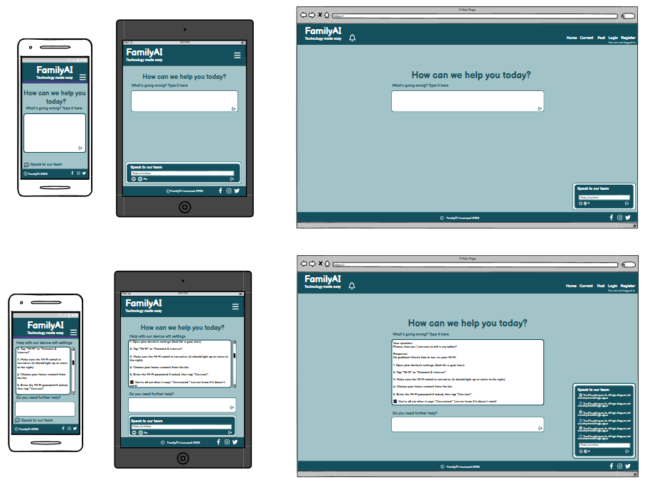

# Family AI

[View the live project here.](https://family-ai-3bfb51c271b9.herokuapp.com)

Family AI is a **smart chatbot** designed to help family members troubleshoot technology issues. Powered by **OpenAI's API** and built with **Django**, it provides step-by-step guidance in a conversational, user-friendly interface.

---

## Project Overview
Family AI simplifies tech support by offering **AI-driven assistance** for common device, software, and connectivity problems. Whether it's fixing a printer or setting up a smartphone, the chatbot delivers **clear, jargon-free solutions** tailored for all ages.

---

## Target Audience
- **Non-tech-savvy family members** - Elderly parents, children, or relatives needing simple guidance.
- **Busy caregivers** - Those assisting others with tech issues remotely.
- **Households with shared devices** - Families managing multiple gadgets and accounts.

---

## Key Features
✅ **AI-Powered Troubleshooting** - Uses OpenAI to interpret and resolve tech issues.  
✅ **Conversational Interface** - Chat-based interaction for ease of use.  
✅ **Multi-Device Support** - Covers smartphones, laptops, smart TVs, and more.  
✅ **Django Backend** - Reliable and scalable for future enhancements.  

---

## User Experience (UX)

### Design

#### Color Scheme
- **Primary**: `#134F5C` ("Deep Teal")  
  Used for: Headers, footers, and primary text in the main body  
- **Secondary**: `#FFFFFF` ("Pure White")  
  Used for: Dividing lines between sections, header/footer text  
- **Tertiary**: `#A2C4C9` ("Misty Blue")  
  Used for: Main background color

#### Typography
- **Body Text**: `Commissioner, sans-serif`
- **Headings**:  `Genos, cursive`

#### Wireframes

